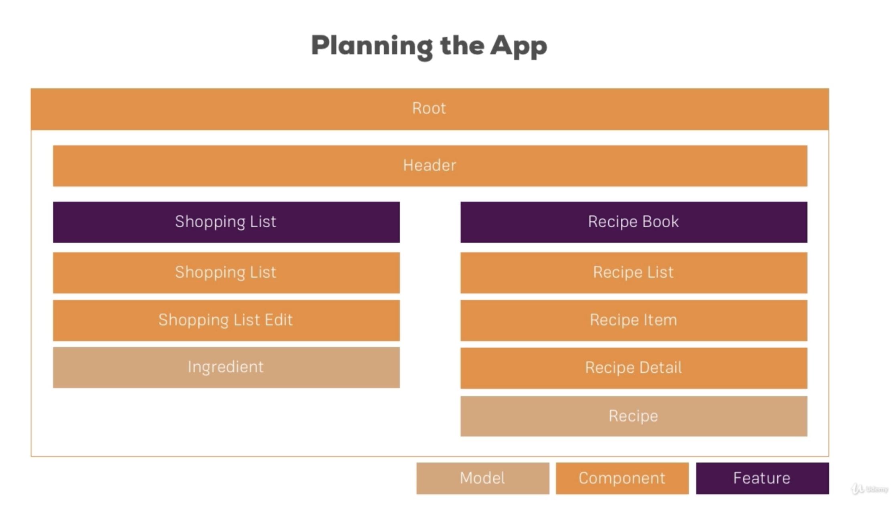
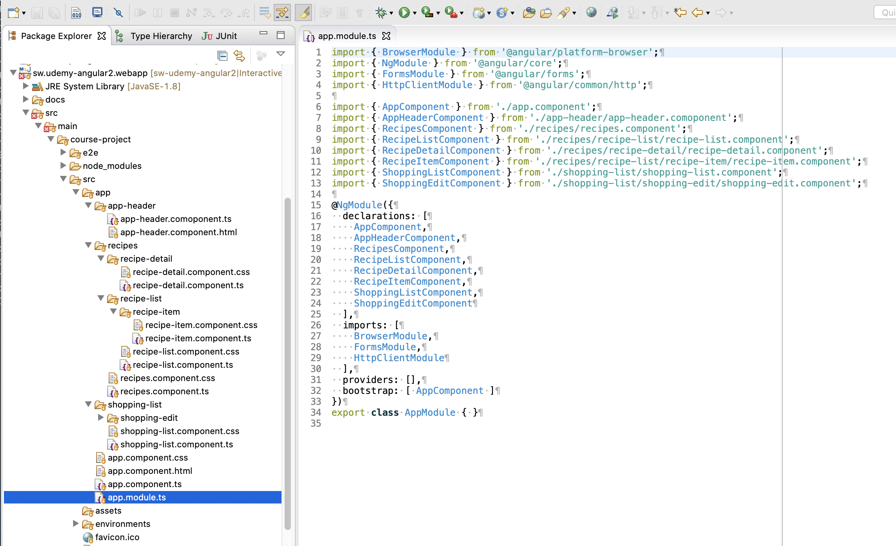
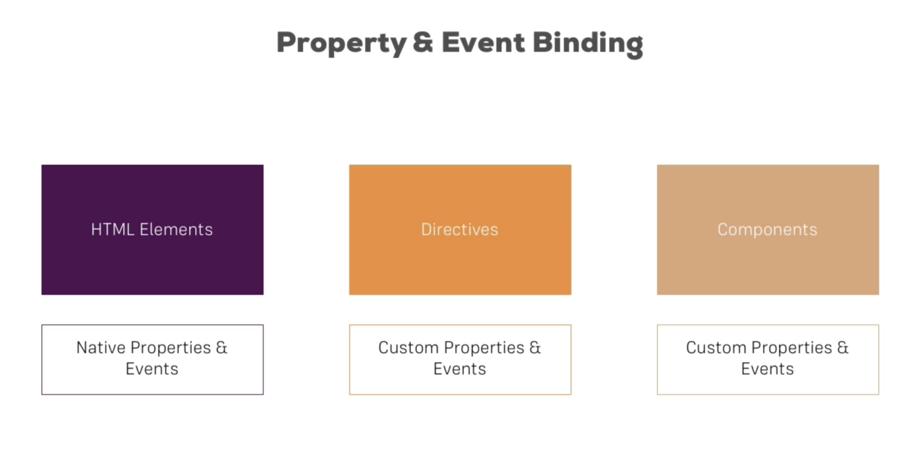
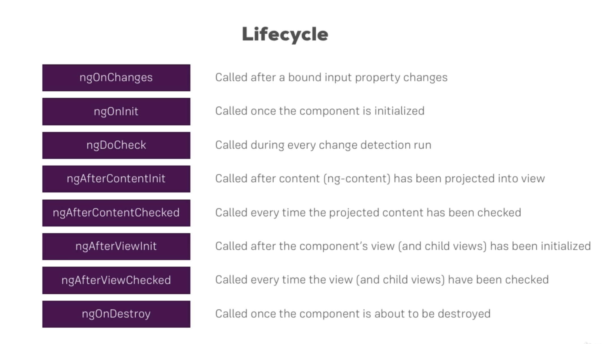
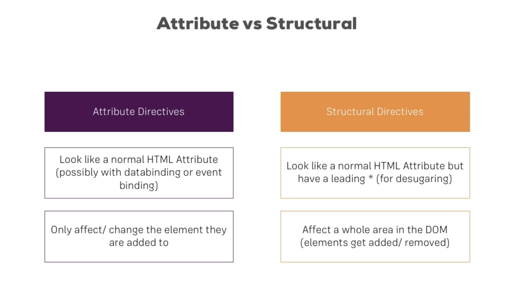
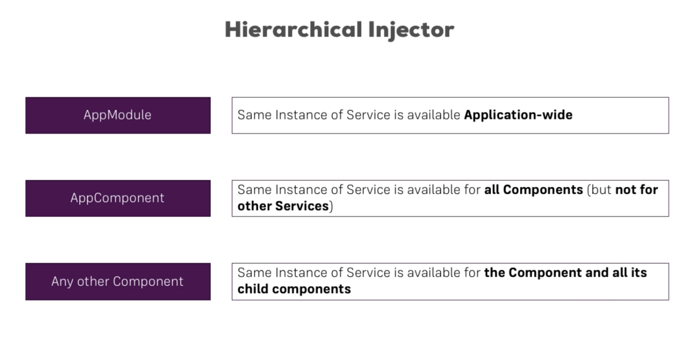
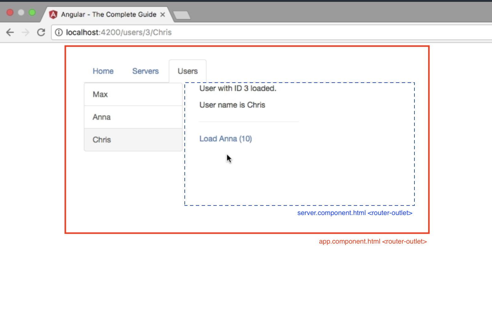

# Course Project

Application created by the `Course Project` section of the course.

To build / enable:

```bash
$ pushd sw.udemy-angular2.webapp/src/main
$ rm web
$ ln -s course-project web
$ popd
$ mvn clean install
```

## Planning the application



## Adding bootstrap (the correct way)

`The Basics` added `bootstrap` by following [medium.com](https://medium.com/codingthesmartway-com-blog/using-bootstrap-with-angular-c83c3cee3f4a)

However ... what you should do is ...

* Install plugin using `npm`, eg.
  
  ```bash
  $ npm install bootstrap@3 jquery --save
  ```

* Update `angular.json` (to bundle bootstrap with the application), eg.

  ```
  "styles": [
      "node_modules/bootstrap/dist/css/bootstrap.min.css",
      "src/styles.css"
  ],
  "scripts": [
      "node_modules/jquery/dist/jquery.min.js",
      "node_modules/bootstrap/dist/js/bootstrap.min.js"
  ]
  ```

## Creating the components

Use `ng generate component`

`--skip false` (used in course notes) changed to `--skipTests=true`

```bash
$ cd sw.udemy-angular2.webapp/src/main/web
$ ng g c recipes --skipTests=true
CREATE src/app/recipes/recipes.component.css (0 bytes)
CREATE src/app/recipes/recipes.component.ts (297 bytes)
UPDATE src/app/app.module.ts (645 bytes)
$ ng g c recipes/recipe-list --skipTests=true
CREATE src/app/recipes/recipe-list/recipe-list.component.css (0 bytes)
CREATE src/app/recipes/recipe-list/recipe-list.component.ts (312 bytes)
UPDATE src/app/app.module.ts (758 bytes)
$ ng g c recipes/recipe-detail --skipTests=true
CREATE src/app/recipes/recipe-detail/recipe-detail.component.css (0 bytes)
CREATE src/app/recipes/recipe-detail/recipe-detail.component.ts (320 bytes)
UPDATE src/app/app.module.ts (879 bytes)
$ ng g c recipes/recipe-list/recipe-item --skipTests=true
CREATE src/app/recipes/recipe-list/recipe-item/recipe-item.component.css (0 bytes)
CREATE src/app/recipes/recipe-list/recipe-item/recipe-item.component.ts (312 bytes)
UPDATE src/app/app.module.ts (1005 bytes)
$ ng g c shopping-list --skipTests=true
CREATE src/app/shopping-list/shopping-list.component.css (0 bytes)
CREATE src/app/shopping-list/shopping-list.component.ts (316 bytes)
UPDATE src/app/app.module.ts (1113 bytes)
$ ng g c shopping-list/shopping-edit --skipTests=true
CREATE src/app/shopping-list/shopping-edit/shopping-edit.component.css (0 bytes)
CREATE src/app/shopping-list/shopping-edit/shopping-edit.component.ts (316 bytes)
UPDATE src/app/app.module.ts (1235 bytes)
```



## Live Development Server

Applications can run using the `ng serve`, eg.

```bash
$ cd sw.udemy-angular2.webapp/src/main/web
$ ng serve

chunk {main} main.js, main.js.map (main) 29.1 kB [initial] [rendered]
chunk {polyfills} polyfills.js, polyfills.js.map (polyfills) 141 kB [initial] [rendered]
chunk {runtime} runtime.js, runtime.js.map (runtime) 6.15 kB [entry] [rendered]
chunk {scripts} scripts.js, scripts.js.map (scripts) 126 kB [entry] [rendered]
chunk {styles} styles.js, styles.js.map (styles) 978 kB [initial] [rendered]
chunk {vendor} vendor.js, vendor.js.map (vendor) 3.11 MB [initial] [rendered]
Date: 2020-05-10T18:40:24.396Z - Hash: 316a72c5e94e8a7a39cf - Time: 4995ms
** Angular Live Development Server is listening on localhost:4200, open your browser on http://localhost:4200/ **
: Compiled successfully.
```

The server will automatically rebuilt the application whenever changes are made.

## Bean declarations

```
export class Recipe {
    constructor(public name: string, public description: string, public imagePath: string) {
    }
}
```

is shorthand for ...

```
export class Recipe {
    public name: string;
    public description: string;
    public imagePath: string;

    constructor(name: string, description: string, imagePath: string) {
        this.name = name;
        this.description = description;
        this.imagePath = imagePath;
    }
}
```

## Debugging tools

* [Augury](https://augury.rangle.io/)

## Property & Event Binding



### Two-way property binding

Use `ngModel`, eg.

```
<input ... [(ngModel)] = "serverName" />

<button (onclick)="onAddServer($event)">Add</button>

export class CockpitComponent {
  serverName = '';

  onAddServer(onclickEvent: MouseEvent) {
    console.log(serverName);
  }
}
```

### Passing references to HTML elements

Pass HTML elements into `typescript` methods using `#name`, eg.

```
<input ... #serverNameInput />

<button (onclick)="onAddServer(#serverNameInput)">Add</button>

export class CockpitComponent {
  onAddServer(serverNameInput: HTMLInputElement) {
    console.log(serverNameInput.value);
  }
}
```

### Binding directly to HTML elements

Use `@ViewChild` to bind to HTML elements in `*.component.html`, eg.

```
<input ... #serverNameInput />

export class CockpitComponent {
  @ViewChild('serverNameInput') serverNameInput: ElementRef;

  onAddServer() {
    console.log(serverNameInput.nativeElement.value);
  }
}
```

### Passing data into components

Use `@Input` to declare properties that can be `set` from outside the component, eg.

```
export class ServerElementComponent {
  @Input() serverElement: {type: string, name: string, content: string};
}

<app-server-element
  *ngFor="let i of serverElements"
  [serverElement]="i"
></app-server-element
```

### Sending data from components

Use `#Output` to declare event emitters, eg.

```
export class CockpitComponent {
  @Output serverCreated = new EventEmitter<{serverName: string, serverContent: string}>();

  onAddServer(serverNameInput: HTMLInputElement, serverContentInput: HTMLInputElement) {
    serverCreated.emit({serverName: serverNameInput.value, serverContent: serverContentInput.value});
  }
}

<app-cockpit (serverCreated)="onServerAdded($event)"></<app-cockpit>

export class AppComponent {
  onServerAdded(serverData: {serverName: string, serverContent: string}) {
    console.log(serverData.serverName);
  }
}
```

### Passing HTML content into components

Use `ng-content` to declare HTML blocks that can be defined outside the component, eg.

* `server-element.component.html`

  ```
  <div class="panel-body">
      <ng-content></ng-content>
  </div>
  ```

* `app.component.html`

  ```
  <app-server-element *ngFor="let e of serverElements">
      <p>
          <strong *ngIf="e.type === 'server'">{{ e.content }}</strong>
          <em *ngIf="e.type === 'blueprint'">{{ e.content }}</em>
      </p>
  </app-server-element
  ```

## Component Lifecycle Hooks



## Directives



### Core directives

`ngIf`, `ngFor`, `ngSwitch`, `ngClass` & `ngStyle`, eg.

```
<div *ngIf="!showOddNumbersOnly">
  <li
    *ngFor="let number of evenNumbers"
    [ngClass]="{myCssClass: number < 5}"
    [ngStyle]="{backgroundColor: number > 5 ? 'yellow' : 'transparent'}">
    <div [ngSwitch]="number">
      <p *ngSwitchCase="5">Value is 5</p>
      <p *ngSwitchDefault">Value is ?</p>
    </div>
  </li>
</div>
```

### Custom directives

* Create `blue-highlight/blue-highlight.directive.ts` using
  
  ```bash
  $ ng generate directive blue-highlight`
  ```

* Add implementation
  
  ```
  @Directive({
      selector: '[appBlueHighlight]'
  })
  export class BlueHighlightDirective implements OnInit {
      @Input() defaultColor: string = 'transparent';
      @Input() highlightColor: string = 'blue';
      
      @HostBinding('style.backgroundColor') backgroundColor: string;
      
      constructor(private elementRef: ElementRef) {
      }
      
      ngOnInit() {
          this.backgroundColor = this.defaultColor;
      }
      
      @HostListener('mouseEnter') mouseOver(eventData: Event) {
          this.backgroundColor = this.highlightColor;
      }
      
      @HostListener('mouseLeave') mouseLeave(eventData: Event) {
          this.backgroundColor = this.defaultColor;
      }
  }
  ```

* Import declaration in `app.module.ts`
  
  ```
  @NgModule({
      declarations: [
          BlueHighlightDirective
      ],
  ```

* Use directive in HTML content
  
  ```
  <p appBlueHighlight [defaultColor]="'yellow'" [highlightColor]="'red'"> ... </p>
  ```

### Default property binding

For example,

```
<p [appBlueHighlight]="'red'"> ... </p>
```

Alias the `default` input with the dirtective's name, eg.

```
@Input('appBlueHighlight') highlightColor: string = 'blue';
```

### Using RendererV2

Alternative implementation of `BlueHighlightDirective` using `RendererV2`

```
export class BlueHighlightDirective {
  constructor(private elementRef: ElementRef, private renderer: RendererV2) {
  }
  
  @HostListener('mouseEnter') mouseOver(eventData: Event) {
      this.renderer.setStyle(elementRef.nativeElement, 'background-color', 'blue', false, false);
  }
  
  @HostListener('mouseLeave') mouseLeave(eventData: Event) {
      this.renderer.setStyle(elementRef.nativeElement, 'background-color', 'transparent', false, false);
  }
}
```

## Services

For example,

```
export class LoggingService {
  logStatusChanged(status: string) {
    console.log('status changed: ' + status);
  }
}

@Injectable
export class AccountsService {
  accounts = [];

  constructor(private logger: LoggingService) {
  }

  addAccount(name: string, status: string) {
    this.accounts.push({name: name, status: status});
    this.logger.logStatusChanged(status);
  }

  updateStatus(id: number, status: string) {
    this.accounts[id].status = status;
    this.logger.logStatusChanged(status);
  }
}
```

Declare in `*.service.ts` files.

Use `@Injectable` when dependency injection required.

Declare service in `providers` when injecting into components or directives, eg.

```
@Component({
  providers: [AccountsService]
})
```

### Cross-Component Communication

Use `EventEmitter`

```
export class AccountsService {
  statusUpdated = new EventEmitter<string>();
}

export class AccountComponent {
  @Input() id: number;

  constructor(private accountsServce: AccountsService) {
  }

  onSetStatus(status: string) {
    this.accountsService.updateStatus(this.id, status);
    this.accountsService.statusUpdated.emit(status);
  }
}

export class NewAccountComponent {
  constructor(private accountsService: AccountService) {
    this.accountsService.statusUpdated.subscribe(
       (status: string) => console.log('account status changed: ' + status);
    );
  }
}
``` 

### Dependency injection

Declare global services in `app.module.ts`, eg.

```
@NgModule({
  providers: [AccountsService]
})
```

Declare service in `*.comoponent.ts` for local to component (and its children), eg.

```
@Component({
  providers: [AccountsService]
})
```

Local declarations override global ones, ie.



## Routes

### Declaring routes

* Add `RouterModule` in `app.module.ts`, eg.
  
  ```
  const applicationRoutes: Routes[ 
      { path: "",        component: HomeComponent },
      { path: "users",   component: UsersComponent },
      { path: "servers", component: ServersComponent },
  ];
  
  @NgModule({
      imports: [
          RouterModule.forRoot(applicationRoutes)
      ]
  });
  ```

* Add `router-outlet` to `app.component.html`, eg.
  
  ```
  <div class="row">
      <div class="col-xs-12">
          <router-outlet></router-outlet>
      </div>
  </div>
  ```

* Declare links using `routerLink`, eg.
  
  ```
  <a [routerLink]="/users">Users</a>
  ```

* Programmatic navigation, eg.
  
  ```
  constructor(
      private router: Router,
      private route: ActivatedRoute) {
  }

  onShowServersPage() {
      this.router.navigate(['users'], {relativeTo: this.route});
  }
  ```

 *NB.* Use `relativeTo` to ensure navigation from the current position

### External routing modules

When the number of routes is too large for embedding.

* Create routing module, eg. `app-routing.module.ts`
  
  ```
  const appRoutes: Routes = [ ... ];
  
  @NgModule({
      imports: [
          RouterModule.forRoot(appRoutes)
      ],
      exports: [
          RouterModule
      ]
  })
  export class AppRoutingModule {
  }
  ```

* Import module in `app.modules.ts`, eg.
  
  ```
  @NgModule({
      imports: [
          AppRoutingModule
      ]
  })
  ```

### Route parameters

* Declare parameters in route
  
  Use ':' to declare dynamic parameters, eg.
  
  ```
  const applicationRoutes: Routes[ 
      { path: "users/:id/:name",    component: UserComponent },
      { path: "servers/:id",        component: ServerComponent }
      { path: "servers/:id/edit",   component: EditServerComponent }
  ];
  ```

* Loading initial route parameters
  
  ```
  user: {id: number, name: string};
  
  constructor(private route: ActivatedRoute) {
  }
  
  ngOnInit() {
      this.user = {
          id: +this.route.snapshot.params['id'],
          name: this.route.snapshot.params['name']
      };
  }
  ```

  *NB.* Parameters are always strings ; Convert to numeric value using `+`

* Updating route parameters
  
  Imagine a page that has links to itself, eg. view related user
  
  Use [observables](https://angular.io/guide/observables) to update state when the same component is activated with new routes whilst being displaying.
  
  ```
  paramsSubscription: Subscription;
  
  ngOnInit() {
      this.paramsSubscription = this.route.params.subscribe(
          (params: Params) => {
              this.user.id = +params['id'];
              this.user.name = params['name'];
          },
      );
  }
  
  ngOnDestroy() {
      this.paramsSubscription.unsubscribe();
  }
  ```
  
  *NB*. Angular will automatically unsubscribe `params` subscriptions, but most `observables` require manual unsubscription

### Query parameters & Fragments

* Add query parameters to `routerLink`, eg.
  
  ```
  <a
    [routerLink]="['/servers', server.id, 'edit']"
    [queryParams]="{allowEdit: 'true'}"
    fragement="'loading'"
    >Server {{ server.id }}</a>
  ```

* Programmatic routing, eg.
  
  ```
  onEditServer(id: number) {
      this.router.navigate(['/servers', id, 'edit'], {
          queryParams {
              allowEdit: 'true'
          },
          fragment: 'loading'
      });
  }
  ```

* Loading query parameters
  
  ```
  ngOnInit() {
      this.allowEdit = +this.route.snapshot.queryParams['allowEdit'];
      this.gotoLink = this.route.snapshot.fragment;
  }
  ```
  
  *NB.* Both `queryParams` and `fragment` are observables

### Child (Nested) Routes

Allow display of child components inside parent ones, eg.



*NB.* Child routes will typically re-use existing component instances, requiring use of observables to dynamically update route & query parameters

* Declare child routes
  
  ```
  const applicationRoutes: Routes[ 
      { path: "servers", component: ServersComponent, children: [
          { path: ":id",       component: ServerComponent }
          { path: ":id/edit",  component: EditServerComponent }
      ]}
  ];
  ```

* Add `router-outlet` in component HTML

### Preserving query parameters

```
constructor(private route: ActivatedRoute) {
}

onEditServer() {
  this.router.navigate(['edit'], {
    relativeTo: this.route,
    queryParamsHandling: 'preserve'
  });
}
```

Use `queryParamsHandling: merge` when extending parameters.

### Styling route links

For example, apply stated [navbar](https://getbootstrap.com/docs/4.0/components/navbar/) class when route is active.

```
<ul class="nav nav-tabs">
  <li
    routerLinkActive="active"
    [routerLinkActiveOptions]="{exact: true}"><a routerLink="/">Home</a></li>
```

Use `routerLinkActiveOptions` to configure how `routerLinkActive` matches routes.

Use `exact` to stop the '/' route always being active.

NB. All routes start with '/', eg. `/users`

### Redirection & wildcards

Add `not found` page and redirect-all illegal routes to it, eg.

```
const applicationRoutes: Routes[ 
    { path: "not-found", Component: PageNotFoundComponent }
    { path: "**",        redirectTo: "/not-found" }
];
```

`**` wildcard for matching everything.

Always place `**` last.

### canActivate Guard

See [mozilla](https://developer.mozilla.org/en-US/docs/Web/JavaScript/Reference/Global_Objects/Promise) for information about `Promise`

eg. Only allow authenticated users to edit server details

* Declare required services, eg.
  
  ```
  export class AuthService {
      loggedIn = false;
      
      isAuthenticated() {
          const promise = new Promise(
              (resolve, reject) => {
                  setTimeout(() => {
                      resolve(this.loggedIn);
                  }, 1000);
              }
          );
      }
      
      login() {
          this.loggedIn = true;
      }
      
      logout() {
          this.loggedIn = false;
      }
  }
  ```

* Declare guard, eg.
  
  ```
  @Injectable()
  export class AuthGuard implements CanActivate, CanActivateChild {
      constructor(private authService: AuthService, private router: Router) {
      }
      
      canActivate(route: ActivatedRouteSnapshot, state: RouterStateSnapshot) : Observable<boolean> | Promise<boolean> | boolean {
          return this.authService.isAuthenticated().then(
              (authenticated: boolean) => {
                  if (authenticated) {
                      return true;
                  }
                  
                  this.router.navigate(['/']);
              }
          );
      }
      
      canActivateChild(route: ActivatedRouteSnapshot, state: RouterStateSnapshot) : Observable<boolean> | Promise<boolean> | boolean {
          return this.canActivate(route, status);
      }
  }
  ```
  
  `CanActivate` can be applied to a single route.
  
  `CanActivateChild` can be applied to a route's children.

* Add guard to route, eg.
  
  ```
  const appRoutes: Routes = [
      {
          path: 'servers',
          component: ServersComponent,
          canActivate: [
              AuthGuard
          ],
          canActivateChild: [
              AuthGuard
          ],
          ...
      },
  ]
  ```
  
  `canActivate` (optional) guards the route
  
  `canActivateChild` (optional) guards all child routes

### canDeactivate Guard

eg. Ask user to confirm when they want to discard changes

* Declare guard, eg.

  ```
  export interface CanComponentDeactivate {
      canDeactivate: () => Observable<boolean> | Promise<boolean> | boolean;
  }
  
  export class CanDeactivateGuard implements CanDeactivate<CanComponentDeactivate> {
      canDeactivate(
          component: CanComponentDeactivate,
          currentRoute: ActivatedRouteSnapshot,
          state: RouterStateSnapshot,
          nextState: RouterStateSnapshot) : Observable<boolean> | Promise<boolean> | boolean {
          
              return component.canDeactivate();
      }
  } 
  ```

* Implement guard in component, eg.
  
  ```
  export class EditServerComponent implements, OnInit, CanComponentDeactivate {
  
      canDeactivate() : Observable<boolean> | Promise<boolean> | boolean {
          if (!this.changesSaved) {
              // ask user to confirm by displaying confirm dialog
              return confirm('Discard changes?');
          }
          
          return true;
      }
  
  }
  ```

* Add guard to route, eg.
  
  ```
  const appRoutes: Routes = [
      {
          path: ':id/edit',
          component: EditServerComponent,
          canDeactivate: [
              CanDeactivateGuard
          ],
          ...
      },
  ]
  ```

### resolve Guard

Lookup data as part of routing.

* Declare resolver, eg.

  ```
  interface Server {
      id: number;
      name: string;
      status: string;
  }
  
  @Injectable()
  export class ServerResolver implements Resolve<Server> {
      constructor(private serversService : ServersService) {
      }
      
      resolve(route: ActivatedRouteSnapshot, state: RouterStateSnapshot) : Observable<Server> | Promise<Server> | Server {
          return this.serversService.getServer(+route.params['id']);
      }
  } 
  ```

* Add resolver to route, eg.
  
  ```
  const appRoutes: Routes = [
      {
          path: ':id',
          component: ServerComponent,
          resolve: {
              server: ServerResolver
          },
          ...
      },
  ]
  ```

* Use resolver in component, eg.
  
  ```
  export class ServerComponent implements, OnInit {
      server: {id: number, name: string, status: string};
      
      constructor(private route: ActivatedRoute) {
      }
      
      ngOnInit() {
          // page can be refreshed (with new data) whilst being displayed, so must use observable
          this.route.data.subscribe(
              (data: Data) => {
                  this.server = data['server'];
              }
          );
      }
  }
  ```
  
  NB. `data[]` name must match property name used in `Routes.resolve`

