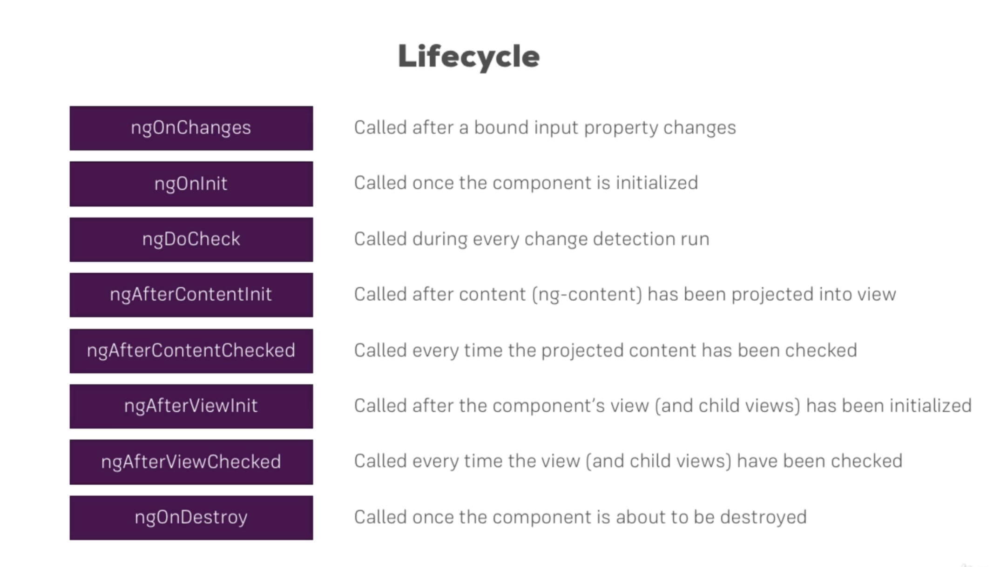
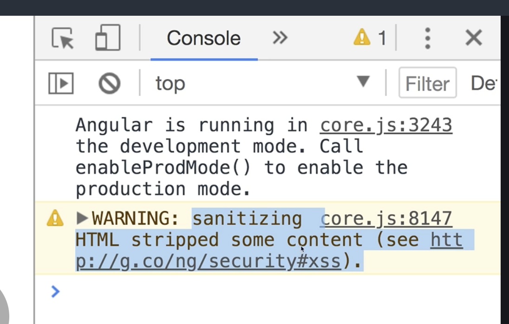

# Components

## Lifecycle Hooks



## Dynamic Components

Normally, you would use `*ngIf`, eg.

```
<div *ngIf="error != null">
    <app-alert [message]="error" (closed)="onAlertClosed()"></app-alert>
</div>
```

But, sometimes you want to create components programmatically.

### Programmatic creation

* Declare placeholder in HTML, eg. `auth.component.html`
  
  ```
  <ng-template appPlaceholder></ng-template>
  ```
  
  The placeholder will provide access to the `ViewContainerRef` (injection point).

* Inject placeholder into component, eg. `auth.component.ts`
  
  ```
  @ViewChild(PlaceholderDirective) alertHost: PlaceholderDirective;
  ```

* Use placeholder and `ComponentFactoryResolver` to create the new component, eg. `auth.component.ts`
  
  ```
  const alertComponentFactory = this.componentFactoryResolver.resolveComponentFactory(
    AlertComponent
  );
  
  const viewContainerRef = this.alertHost.viewContainerRef;
  
  viewContainerRef.clear(); // remove anything that has been rendered
  
  const newAlert = viewContainerRef.createComponent(alertComponentFactory);
  
  newAlert.instance.message = errorMessage;
  ```

Use `viewContainerRef.clear()` to remove the new component, eg. close the pop-up

### Angular elements

Imagine we want to dynamically inject HTML content at runtime, eg. `app.component.html`

```
<div [innerHTML]="content"></div>
```

The following does not work:

```
export class AppComponent {

    constructor(injector: Injector, domSantizer: DomSanitizer) {
        this.content = "<app-alert message='Test message'></app-alert>"; 
    }

}
```

Why? Application tags (eg. `app-alert`) are converted into HTML during compilation. They are not recognised by the browser.

Use [Angular elements](https://angular.io/guide/elements) to inject Angular content at runtime, eg.

```
constructor(injector: Injector, domSantizer: DomSanitizer) {
    const alertElement = createCustomElement(AlertComponent, {
        injector: injector
    });

    customElements.define('my-alert', alertElement);

    this.content = domSantizer.bypassSecurityTrustHtml("<my-alert message='Test message'></my-alert>"); 
}
```

Use `bypassSecurityTrustHtml` to enable `innerHTML` injection at runtime

*NB.* By default, Angular blocks `innerHTML` injection to avoid CSF attacks etc, eg.




