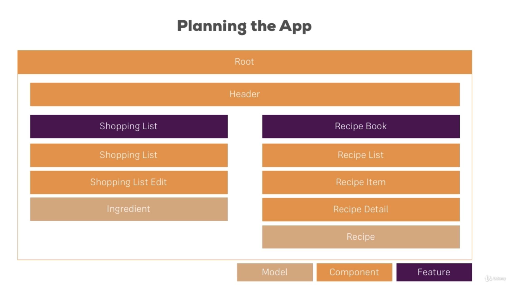
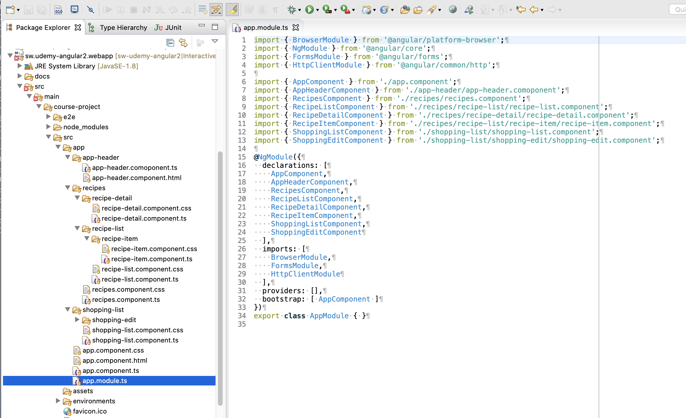

# Create Project

## Planning the application



## Adding bootstrap (the correct way)

`The Basics` added `bootstrap` by following [medium.com](https://medium.com/codingthesmartway-com-blog/using-bootstrap-with-angular-c83c3cee3f4a)

However ... what you should do is ...

* Install plugin using `npm`, eg.
  
  ```bash
  $ npm install bootstrap@3 jquery --save
  ```

* Update `angular.json` (to bundle bootstrap with the application), eg.

  ```
  "styles": [
      "node_modules/bootstrap/dist/css/bootstrap.min.css",
      "src/styles.css"
  ],
  "scripts": [
      "node_modules/jquery/dist/jquery.min.js",
      "node_modules/bootstrap/dist/js/bootstrap.min.js"
  ]
  ```

## Creating components

Use `ng generate component`

`--spec false` (used in course notes) changed to `--skipTests=true`

```bash
$ cd sw.udemy-angular2.webapp/src/main/web
$ ng g c recipes --skipTests=true
CREATE src/app/recipes/recipes.component.css (0 bytes)
CREATE src/app/recipes/recipes.component.ts (297 bytes)
UPDATE src/app/app.module.ts (645 bytes)
$ ng g c recipes/recipe-list --skipTests=true
CREATE src/app/recipes/recipe-list/recipe-list.component.css (0 bytes)
CREATE src/app/recipes/recipe-list/recipe-list.component.ts (312 bytes)
UPDATE src/app/app.module.ts (758 bytes)
$ ng g c recipes/recipe-detail --skipTests=true
CREATE src/app/recipes/recipe-detail/recipe-detail.component.css (0 bytes)
CREATE src/app/recipes/recipe-detail/recipe-detail.component.ts (320 bytes)
UPDATE src/app/app.module.ts (879 bytes)
$ ng g c recipes/recipe-list/recipe-item --skipTests=true
CREATE src/app/recipes/recipe-list/recipe-item/recipe-item.component.css (0 bytes)
CREATE src/app/recipes/recipe-list/recipe-item/recipe-item.component.ts (312 bytes)
UPDATE src/app/app.module.ts (1005 bytes)
$ ng g c shopping-list --skipTests=true
CREATE src/app/shopping-list/shopping-list.component.css (0 bytes)
CREATE src/app/shopping-list/shopping-list.component.ts (316 bytes)
UPDATE src/app/app.module.ts (1113 bytes)
$ ng g c shopping-list/shopping-edit --skipTests=true
CREATE src/app/shopping-list/shopping-edit/shopping-edit.component.css (0 bytes)
CREATE src/app/shopping-list/shopping-edit/shopping-edit.component.ts (316 bytes)
UPDATE src/app/app.module.ts (1235 bytes)
```



## Shorthand declarations

```
export class Recipe {
    constructor(public name: string, public description: string, public imagePath: string) {
    }
}
```

is shorthand for ...

```
export class Recipe {
    public name: string;
    public description: string;
    public imagePath: string;

    constructor(name: string, description: string, imagePath: string) {
        this.name = name;
        this.description = description;
        this.imagePath = imagePath;
    }
}
```

