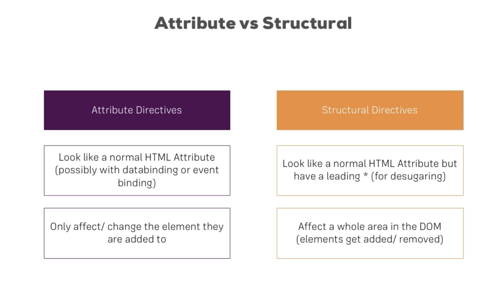

# Directives



## Core directives

`ngIf`, `ngFor`, `ngSwitch`, `ngClass` & `ngStyle`, eg.

```
<div *ngIf="!showOddNumbersOnly">
  <li
    *ngFor="let number of evenNumbers"
    [ngClass]="{myCssClass: number < 5}"
    [ngStyle]="{backgroundColor: number > 5 ? 'yellow' : 'transparent'}">
    <div [ngSwitch]="number">
      <p *ngSwitchCase="5">Value is 5</p>
      <p *ngSwitchDefault">Value is ?</p>
    </div>
  </li>
</div>
```

## Custom directives

* Create `blue-highlight/blue-highlight.directive.ts` using
  
  ```bash
  $ ng generate directive blue-highlight`
  ```

* Add implementation
  
  ```
  @Directive({
      selector: '[appBlueHighlight]'
  })
  export class BlueHighlightDirective implements OnInit {
      @Input() defaultColor: string = 'transparent';
      @Input() highlightColor: string = 'blue';
      
      @HostBinding('style.backgroundColor') backgroundColor: string;
      
      constructor(private elementRef: ElementRef) {
      }
      
      ngOnInit() {
          this.backgroundColor = this.defaultColor;
      }
      
      @HostListener('mouseEnter') mouseOver(eventData: Event) {
          this.backgroundColor = this.highlightColor;
      }
      
      @HostListener('mouseLeave') mouseLeave(eventData: Event) {
          this.backgroundColor = this.defaultColor;
      }
  }
  ```

* Import declaration in `app.module.ts`
  
  ```
  @NgModule({
      declarations: [
          BlueHighlightDirective
      ],
  ```

* Use directive in HTML content
  
  ```
  <p appBlueHighlight [defaultColor]="'yellow'" [highlightColor]="'red'"> ... </p>
  ```

## Default property binding

For example,

```
<p [appBlueHighlight]="'red'"> ... </p>
```

Alias the `default` input with the dirtective's name, eg.

```
@Input('appBlueHighlight') highlightColor: string = 'blue';
```

## Using RendererV2

Alternative implementation of `BlueHighlightDirective` using `RendererV2`

```
export class BlueHighlightDirective {
  constructor(private elementRef: ElementRef, private renderer: RendererV2) {
  }
  
  @HostListener('mouseEnter') mouseOver(eventData: Event) {
      this.renderer.setStyle(elementRef.nativeElement, 'background-color', 'blue', false, false);
  }
  
  @HostListener('mouseLeave') mouseLeave(eventData: Event) {
      this.renderer.setStyle(elementRef.nativeElement, 'background-color', 'transparent', false, false);
  }
}
```
