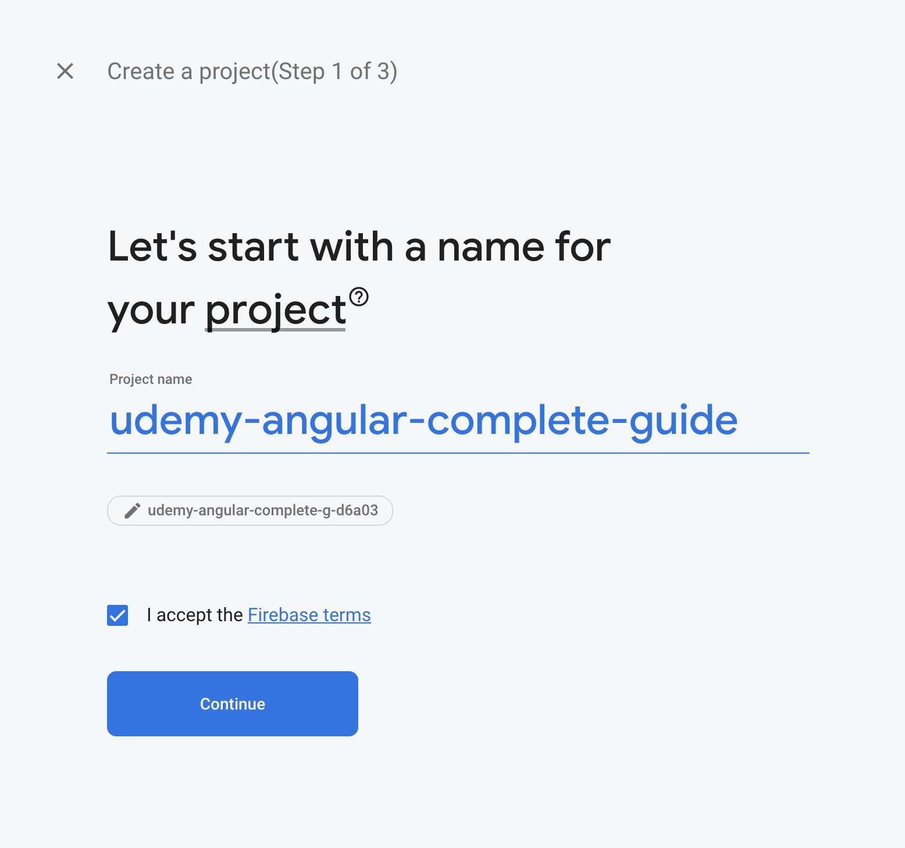
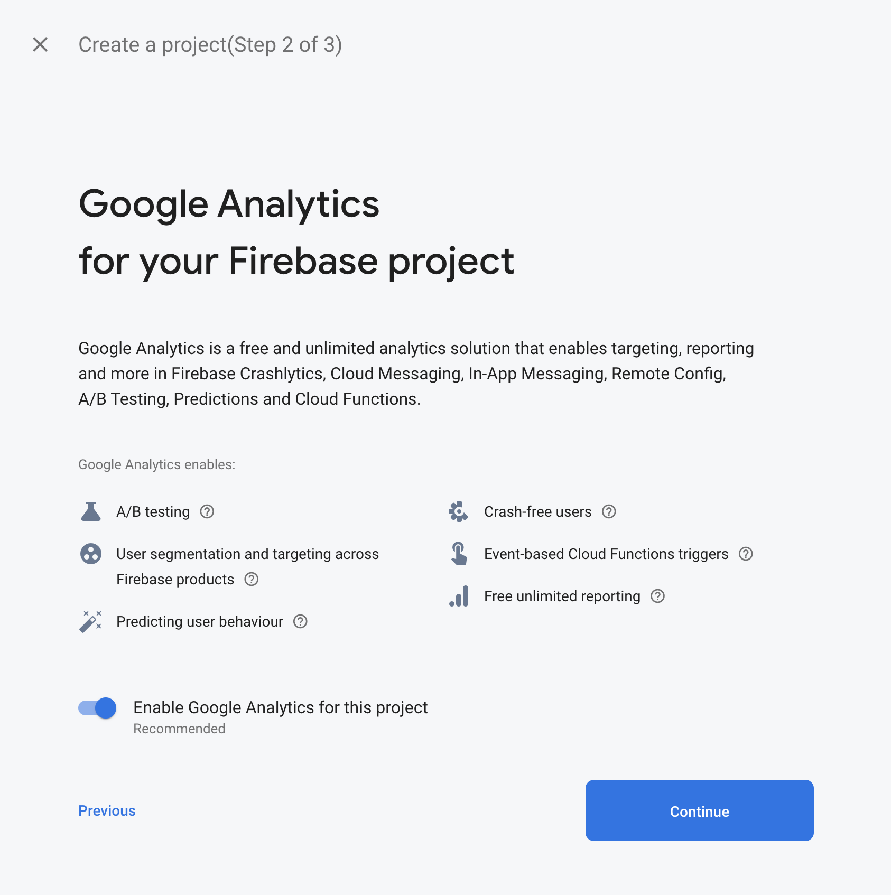
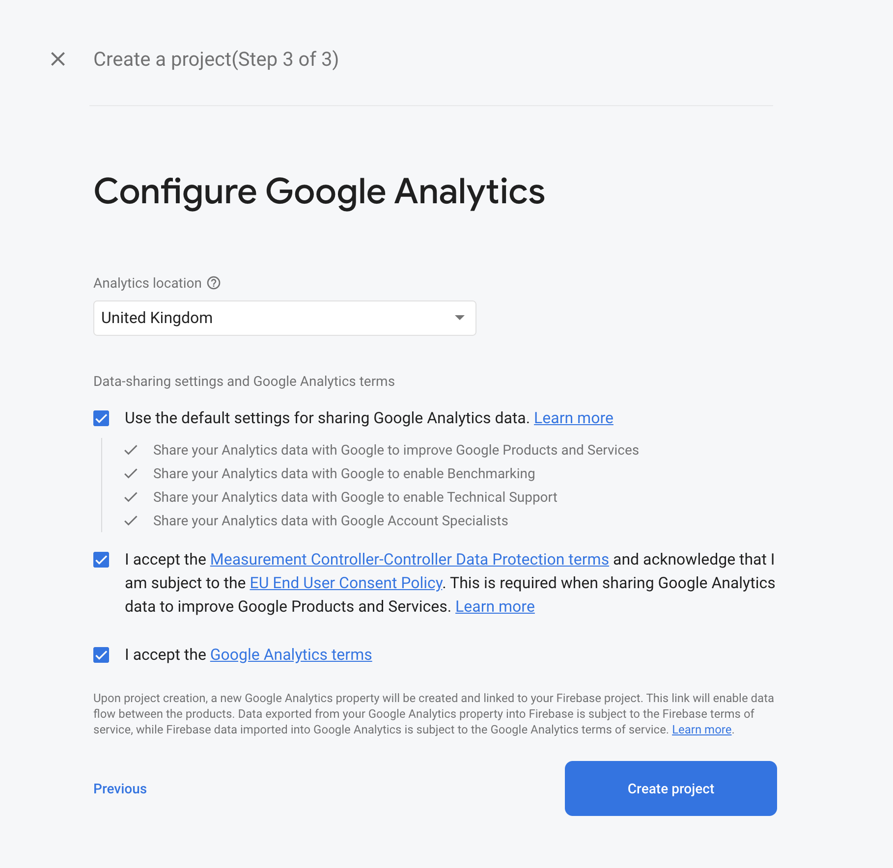
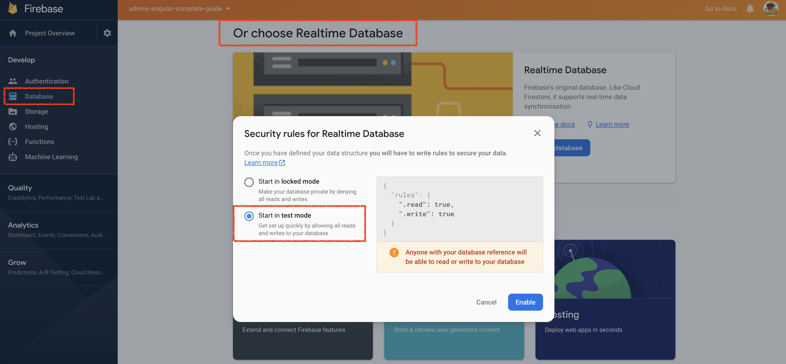
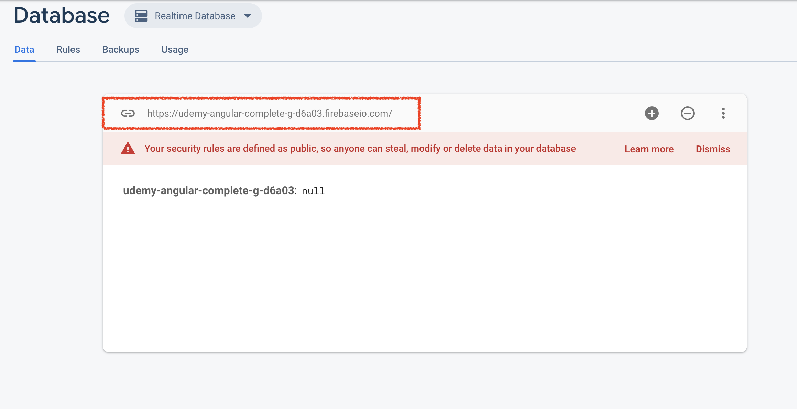
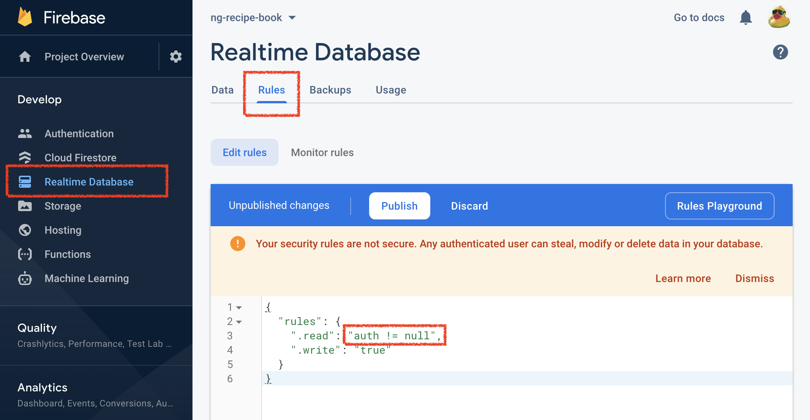
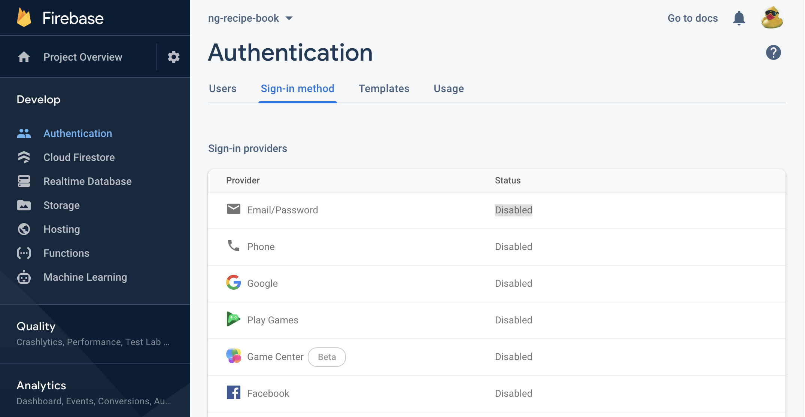

# Google firebase

## Create project

Goto [firebase.google.com](https://console.firebase.google.com/)





## Create realtime database



Your target endpoint will be displayed in the confirmation dialog, eg.



## Setup user authentication

* Restrict database access
  
  Change rules to use `auth != null`, eg.



* Enable email/password based authentication



* Use [authentication API](https://firebase.google.com/docs/reference/rest/auth) to sign-up and login users

## Application hosting

*Warning* - These `manual` steps can be avoided by using [ng deploy](./development-tools.md) 

* Install, eg. `brew install firebase-cli`
* Login, eg.
  
  ```
  $ firebase login
  Waiting for authentication...
  
  ✔  Success! Logged in as yellow.monkey.sw@gmail.com
  ```

* Init project, eg.
  
  ```
  $ cd $PROJECT_HOME
  $ firebase init
  ◉ Hosting: Configure and deploy Firebase Hosting sites  > ng-recipe-book (ng-recipe-book)
  ? Please select an option: Use an existing project
  ? Select a default Firebase project for this directory:
  ❯ ng-recipe-book-ba17b (ng-recipe-book)
  ? What do you want to use as your public directory? ./sw.udemy-angular2.webapp/target/dist
  ? Configure as a single-page app (rewrite all urls to /index.html)? Yes
  ? File ./sw.udemy-angular2.webapp/target/dist/index.html already exists. Overwrite? No
  
  i  Writing configuration info to firebase.json...
  i  Writing project information to .firebaserc...
  
  ✔  Firebase initialization complete!
  ```

  * Deploy, eg.
  
  ```
  $ firebase deploy
  ✔  Deploy complete!
  
  Project Console: https://console.firebase.google.com/project/ng-recipe-book-ba17b/overview
  Hosting URL: https://ng-recipe-book-ba17b.web.app
  ```

* Open application in browser, eg. `https://ng-recipe-book-ba17b.web.app/index.html`
