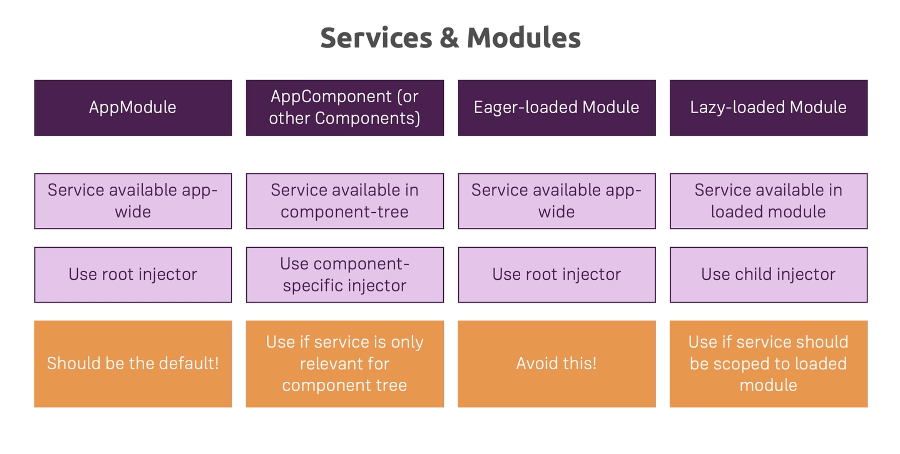

# Modules

## Declaring modules

Use `@ngModule`, eg.

```
@NgModule({
    declarations: [
        DropdownDirective,
        PlaceholderDirective,
        AlertComponent,
        LoadingSpinnerComponent
    ],
    imports: [
        CommonModule
    ],
    entryComponents: [
        AlertComponent
    ],
    exports: [
        CommonModule,
        DropdownDirective,
        PlaceholderDirective,
        AlertComponent,
        LoadingSpinnerComponent
    ]
})
export class SharedModule {}
```

You must import everything the module requires to operate, eg. `FormModule` when components use forms.

Modules should use `exports` when they want to make components available to consumers.

`app.module.ts` cannot `imports` components declared in modules.

## Lazy loading modules

```
const applicationRoutes: Routes = [
    { path: 'recipes', loadChildren: () => { return importRecipesModule(); } },
];

async function importRecipesModule() {
    const m = await import('./recipes/recipes.module');
    return m.RecipesModule;
}
```

The module's `root` path must be blank, eg.

```
const recipesRoutes: Routes = [
    { path: '',
        component: RecipesComponent,
        children: [ ... ]
    },
];
```

### Legacy declarations

Older versions of Angular support the syntax

```
const applicationRoutes: Routes = [
    { path: 'recipes', loadChildren: './recipes/recipes.module#RecipesModulle' },
];
```

but this failed using Angular 9

## Service scope



Modules can declare services scoped to themselves.

Services can also be declared in `app.module.ts` (application root).

When done, the application will contain multiple instances of a service, with different parts of the application using different instances.

To avoid bugs, always declare services using `@Injectable({providedIn: 'root'})`

## Ahead-of-time compilation

Use `ng build` to compile the application, eg.

```
$ ng build --prod
Generating ES5 bundles for differential loading...
ES5 bundle generation complete.

chunk {0} runtime-es2015.e671edf2cab7fb392c95.js (runtime) 2.24 kB [entry] [rendered]
chunk {0} runtime-es5.e671edf2cab7fb392c95.js (runtime) 2.23 kB [entry] [rendered]
chunk {2} polyfills-es2015.1f913f16a2d346cc8bdc.js (polyfills) 36.1 kB [initial] [rendered]
chunk {5} 5-es2015.73ec35be4663e4ea0e9c.js () 11.5 kB  [rendered]
chunk {5} 5-es5.73ec35be4663e4ea0e9c.js () 13.9 kB  [rendered]
chunk {3} polyfills-es5.1a3c78b07cd6f16c6e9a.js (polyfills-es5) 129 kB [initial] [rendered]
chunk {1} main-es2015.f6d18d1bee08e6425f96.js (main) 315 kB [initial] [rendered]
chunk {1} main-es5.f6d18d1bee08e6425f96.js (main) 378 kB [initial] [rendered]
chunk {4} styles.2bd6ebdb59cfadfe33c4.css (styles) 112 kB [initial] [rendered]
chunk {scripts} scripts.a80dc973dc4808ebd09d.js (scripts) 126 kB [entry] [rendered]
Date: 2020-08-28T20:32:10.764Z - Hash: 9478425b953c4a0613b3 - Time: 29677ms
```

*NB.* The `ng build` compiler is less tolerant than `ng serve`. This may trigger compilation failures.

