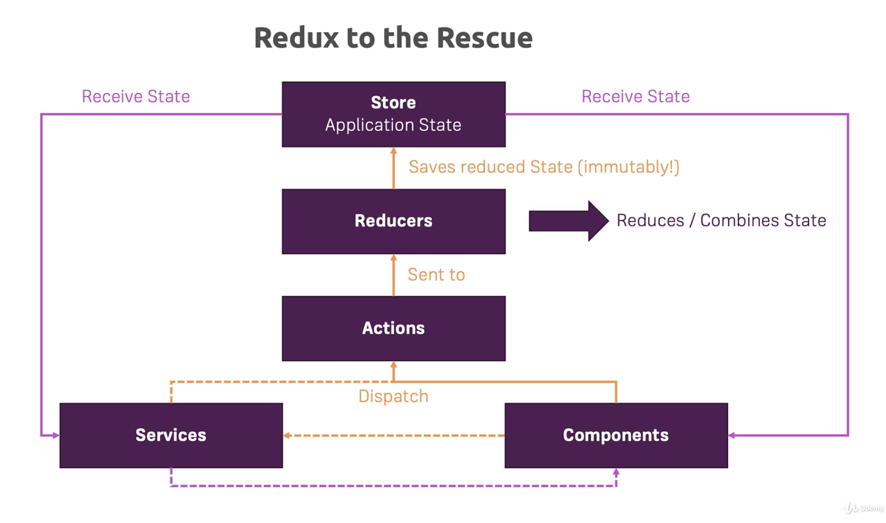

# NgRX

A central [data store](https://ngrx.io/guide/store) for the whole application, where
* data changes are triggered by `actions`
* data `slices` are returned as [Observables](./observables.md)

## Redux vs NgRx

Using [services](./services.md) to store state and [RxJS](./observables.md) for communication:

* State can be updated anywhere
* State can be mutable
* Handling of side effects (eg. Http calls) may be unclear



`NgRx` is Angular's implementation of `Redux`


It provides injectable `store` service and integrates with [NxRJ](./observables.md).

## Installation

```
$ npm install --save @ngrx/store
$ npm install --save @ngrx/effects
```

## Store Actions

eg. `shopping-list.actions.ts`

```
export type AllActions = AddIngredient | ...;

export const UPDATE_INGREDIENT = '[ShoppingList] UpdateIngredient';

export class UpdateIngredient implements Action {
    readonly type = UPDATE_INGREDIENT;

    constructor(public payload: Ingredient) {
    }
}
```

`AllActions` describes all possible `shopping-list` actions ; used in `reducer` declarations.

Each action type is declared as a `class`, eg. `UpdateIngredient`

`[feature] action_name` naming convention used to scope actions names to feature ; avoid name clashes across features

## Store Types

Create types for describing `NgRx` storage types, eg. `shopping-list.reducer.ts`

```
export interface State {
    ingredients: Ingredient[],
    editedIgredient: Ingredient,
    editedIgredientIndex: number
}

export interface AppState {
    shoppingList: State
}
```

## Importing Action Types

```
import * as ShoppingListActions from './store/shopping-list.actions';
import * as fromShoppingList from './store/shopping-list.reducer';
```

## Reducers

Functions that map actions onto the `NgRx` storage, eg. `shopping-list.reducer.ts`

Reducers are declared in `app.module.ts`, eg.

```
@NgModule({
    imports: [
        StoreModule.forRoot({
            shoppingList: shoppingListReducer
        })
    ]
})
export class AppModule { }
```

Reducers must always return immutable state, eg.

```
export function shoppingListReducer(state: State = initialState, action: ShoppingListActions.AllActions): State {
   switch (action.type) {
        case ShoppingListActions.UPDATE_INGREDIENT:
            const ingredient = state.ingredients[state.editedIgredientIndex];

            const updatedIngredients = [...state.ingredients];
            updatedIngredients[state.editedIgredientIndex] = {
                ...ingredient,
                ...action.payload
            };

            return { ...state, ingredients: updatedIngredients };
    }
}
```

Use the [spread operator](https://developer.mozilla.org/en-US/docs/Web/JavaScript/Reference/Operators/Spread_syntax) (`...`) to clone data.

Reducers must support `initial state` (for when the application starts) and handle unrecognised actions via `default`, eg.

```
const initialState: State = {
    ingredients: [],
    editedIgredient: null,
    editedIgredientIndex: -1
};

export function shoppingListReducer(state: State = initialState, ... {
   switch (action.type) {
        default:
            return state;
    }
}
```

*NB.* All reducers receive all actions (including `NgRx` actions).

Strong type reducers to avoid field name mismatches in updated states, eg.

```
export function shoppingListReducer(...): State {
```

*Warning -* Javascript will add wrongly named properties as `new` fields. Typing will allow the editor to guide you!

## Dispatching Actions

```
constructor(private store: Store<fromShoppingList.AppState>) {
}

onAddIngredient() {
    const newIngedient = ...

    if (this.isEditing()) {
        this.store.dispatch(new ShoppingListActions.UpdateIngredient(newIngedient));
    } else {
        this.store.dispatch(new ShoppingListActions.AddIngredient(newIngedient));
    }

    this.onClearForm();
}
```

## Using Store Data

`store#select()` returns [Observable](./observables.md).

Use `async` operator inside HTML, eg.

```
<ul class="list-group">
    <a *ngFor = "let ingredient of (shoppingList | async).ingredients let i = index"
```

## Application Reducer

Declare the application wide `AppState`, eg.

```
export interface AppState {
    auth: fromAuth.State,
    shoppingList: fromShoppingList.State
}
```

Simplify `app.module.ts` by creating a `ActionReducerMap`, eg.

```
export const appReducerMap: ActionReducerMap<AppState> = {
    auth: fromAuth.authReducer,
    shoppingList: fromShoppingList.shoppingListReducer
};
```

## Effects

### Setup container class 

Declare container class, eg.

```
@Injectable()
export class AuthEffects {

    constructor (private actions: Actions, private http: HttpClient) {
    }

}
```

*NB.* Use `@Injectable` when services should be injected via `constructor`

Import, eg.

```
@NgModule({
    imports: [
        EffectsModule.forRoot([
            AuthEffects
        ]),
    ]
})
export class AppModule { }
```

### Adding effects

Create one or more public members (any name) annotated with `@Effect`, eg.

```
@Effect()
loginRequestedEffect = this.actions.pipe(
    ofType(AuthActions.LOGIN_REQUESTED),
    switchMap( (action: AuthActions.LoginRequested) => {
        return this.http
            .post<AuthServiceResponse>(...)
            .pipe(
                map(responseData => {
                    return new AuthActions.UserSignedIn(...)
                }),
                catchError(error => {
                    return of(new AuthActions.LoginFailed(...);
                })
            );
    })
);
```

Effect observers must *always* return an active observable containing a `replacement` action (aka. the `next` action in the chain).

`ofType` restricts action types handled by `pipe` (ie. the action types this `pipe` consumes)

`switchMap` returns the `replacement` action when `post` is successful.

`catchError` never propagates the error. Use `of` to return the `replacement` action, eg. `LoginFailed`

Use `dispatch: false` when the `pipe` does not return a `replacement` action, eg.

```
@Effect({dispatch: false})
userSignedOutEffect = this.actions.pipe(
    ofType(AuthActions.USER_SIGNED_OUT),
    tap( (action: AuthActions.UserSignedOut) => {
        ...
    })
);
```

## Dispatching Actions Inside Resolvers

`store#dispatch()` does not return observable.

Use `Actions` inside the resolver, eg.

```
@Injectable({providedIn: 'root'})
export class RecipeResolver implements Resolve<Recipe> {

    constructor(private store: Store<fromApp.AppState>, private actions: Actions) {
    }

    resolve(route: ActivatedRouteSnapshot, state: RouterStateSnapshot) : Promise<Recipe> | Observable<Recipe> | Recipe {
        this.store.dispatch(new RecipesActions.FetchRecipes()); // triggers SET_RECIPES

        // return a new observer that waits for FETCH_RECIPES to complete

        return this.actions.pipe(
            ofType(RecipesActions.SET_RECIPES),
            take(1)
        );
    }

}
```

## Loading Store Values Inside Effects

Use `withLatestFrom` to return the value from an observable, eg.

```
@Effect({dispatch: false})
storeRecipes = this.actions.pipe(
    ofType(RecipesActions.STORE_RECIPES),
    withLatestFrom(this.store.select('recipes')),
    switchMap( ([actionData, recipesState]) => {
        return this.http.put('http://...', recipesState.recipes)
    })
);
```

`withLatestFrom` passes its return value into `switchMap` as the 2nd parameter (`recipesState`)

## Developer tools

### Store Devtools

See [Redux devtools](https://github.com/zalmoxisus/redux-devtools-extension)

Install, eg.

```
$ npm install --save-dev @ngrx/store-devtools
```

Import, eg.

```
@NgModule({
    imports: [
        StoreDevtoolsModule.instrument({ logOnly: environment.production })
    ]
})
```

Use browser plugin, eg.


### Router store

See [ngrx.io](https://ngrx.io/guide/router-store)

Install, eg.

```
$ npm install --save-dev @ngrx/router-store
```
Import, eg.

```
@NgModule({
    imports: [
        StoreRouterConnectingModule.forRoot()
    ]
})
```

Use via `devtools` plugin, eg.


