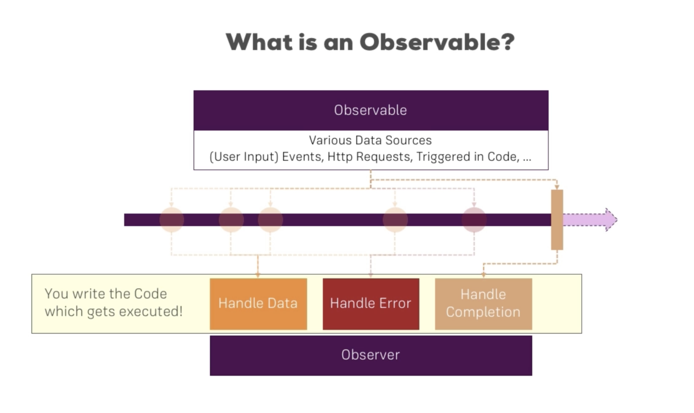

# Observables



See [angular.io](https://angular.io/guide/observables)

See [academind.com](https://academind.com/learn/javascript/understanding-rxjs/)

## Example usage

```
import { interval, Subscription } from 'rxjs';

export class TestComponent implements OnInit, OnDestroy {
    private intervalSubscription: Subscription;

    ngOnInit() {
        this.intervalSubscription = interval(1000).subscribe( (count: number) => {
            console.log(count + " seconds have passed");
        });
    }

    ngOnDestroy() {
        this.intervalSubscription.unsubscribe();
    }
}
```

*Warning -* Failure to stop subscriptions will cause memory leaks

*NB.* Angular automatically stops subscriptions for observables it provides (eg. `route.params`). 

## Custom observable

```
const myObservable = Observable.create(observer => {
    let count = 0;

    setInterval( () => {
        observer.next(count);

        if (count > 3) {
            observer.error(new Error("count > 3!"));
        }

        if (count === 5) {
            observer.complete();
        }

        count++;
    }, 1000);
});

this.mySubscription = myObservable.subscribe(
    (data: number) => {
        console.log("Data changed: " + data);
    },
    error => {
        console.log("Error: " + error);
    },
    () => {
        console.log("Completed!");
    }
);
```

Errors will raise exceptions (inside the application) unless the `error` callback is provided.

`complete` stops the observable, but you still need to unsubscribe.

`complete` is not fired on error.

## Operators

See [learnrxjs.io](https://www.learnrxjs.io/)

Use `pipe` to convert published data into new forms, eg. changing the numeric counter into a message

```
this.mySubscription = myObservable
    .pipe(map( (data: number) => {
        return "Round " + (data + 1);
    })).subscribe(
        (data: string) => {
            console.log("Data changed: " + data);
        },
        error => { ... }
        () => { ... }
    );
```

## Subject

See [learnrxjs.io](https://www.learnrxjs.io/)

Replacement for `EventEmitter` for cross-component communication.

*NB.* You must still use `EventEmitter` for `@Output` properties.

```
export class UserService {
    activatedEmitter = new Subject<boolean>;
}

@Injectable()
export class UserComponent {
    constructor(private userService: UserService) {
    }

    onActivated() {
        userService.activatedEmitter.next(true);
    }
}

@Injectable()
export class MyComponent implements OnInit, OnDestroy {
    private activatedSubscription: Subscription;

    constructor(private userService: UserService) {
    }

    ngOnInit() {
        this.activatedSubscription = this.userService.subscribe( (flag: boolean) => {
            console.log("User activation: " + flag);
        });
    }

    ngOnDestroy() {
        this.activatedSubscription.unsubscribe();
    }
}
```

## Behaviour Subject

A `Subject` that remembers the last value it sent.

Declare as per `Subject`, eg.

```
user = new BehaviorSubject<User>(null);
```

NB. Constructor argument = initial value.

Use `take` operator to access, eg.

```
return this.authService.user.pipe(
    take(1),
    exhaustMap( user => {
    }),
    ...
```

