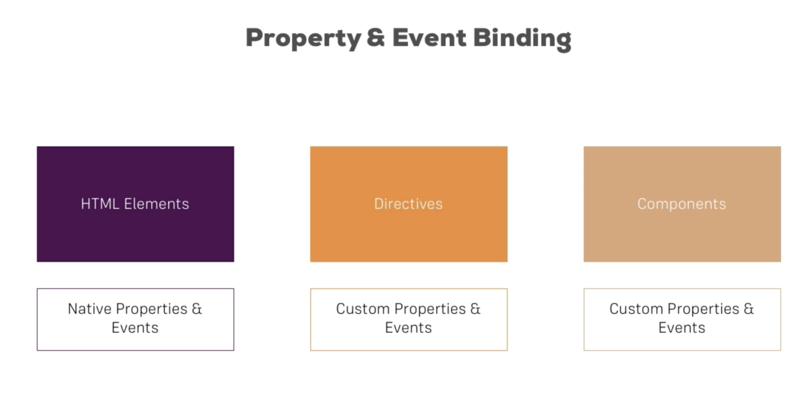

# Property & Event Binding



## One-way property binding

Use `{{ }}`, eg.

```
<input
    type="text"
    class="form-control"
    (input) = "onServerNameChanged($event)" />

<p>serverName = {{ serverName }}</p> 
```

Or, property binding, eg.

```
<p>serverName = <span [innerText] = "serverName"></span></p> 
```

## Two-way property binding

Use `ngModel`, eg.

```
<input ... [(ngModel)] = "serverName" />

<button (onclick)="onAddServer($event)">Add</button>

export class CockpitComponent {
  serverName = '';

  onAddServer(onclickEvent: MouseEvent) {
    console.log(serverName);
  }
}
```

## Passing references to HTML elements

Pass HTML elements into `typescript` methods using `#name`, eg.

```
<input ... #serverNameInput />

<button (onclick)="onAddServer(#serverNameInput)">Add</button>

export class CockpitComponent {
  onAddServer(serverNameInput: HTMLInputElement) {
    console.log(serverNameInput.value);
  }
}
```

## Binding directly to HTML elements

Use `@ViewChild` to bind to HTML elements in `*.component.html`, eg.

```
<input ... #serverNameInput />

export class CockpitComponent {
  @ViewChild('serverNameInput') serverNameInput: ElementRef;

  onAddServer() {
    console.log(serverNameInput.nativeElement.value);
  }
}
```

## Passing data into components

Use `@Input` to declare properties that can be `set` from outside the component, eg.

```
export class ServerElementComponent {
  @Input() serverElement: {type: string, name: string, content: string};
}

<app-server-element
  *ngFor="let i of serverElements"
  [serverElement]="i"
></app-server-element
```

## Publishing data from components

Use `@Output` to declare event emitters, eg.

```
export class CockpitComponent {
  @Output serverCreated = new EventEmitter<{serverName: string, serverContent: string}>();

  onAddServer(serverNameInput: HTMLInputElement, serverContentInput: HTMLInputElement) {
    serverCreated.emit({serverName: serverNameInput.value, serverContent: serverContentInput.value});
  }
}

<app-cockpit (serverCreated)="onServerAdded($event)"></<app-cockpit>

export class AppComponent {
  onServerAdded(serverData: {serverName: string, serverContent: string}) {
    console.log(serverData.serverName);
  }
}
```

## Passing HTML content into components

Use `ng-content` to declare HTML blocks that can be defined outside the component, eg.

* `server-element.component.html`

  ```
  <div class="panel-body">
      <ng-content></ng-content>
  </div>
  ```

* `app.component.html`

  ```
  <app-server-element *ngFor="let e of serverElements">
      <p>
          <strong *ngIf="e.type === 'server'">{{ e.content }}</strong>
          <em *ngIf="e.type === 'blueprint'">{{ e.content }}</em>
      </p>
  </app-server-element
  ```

