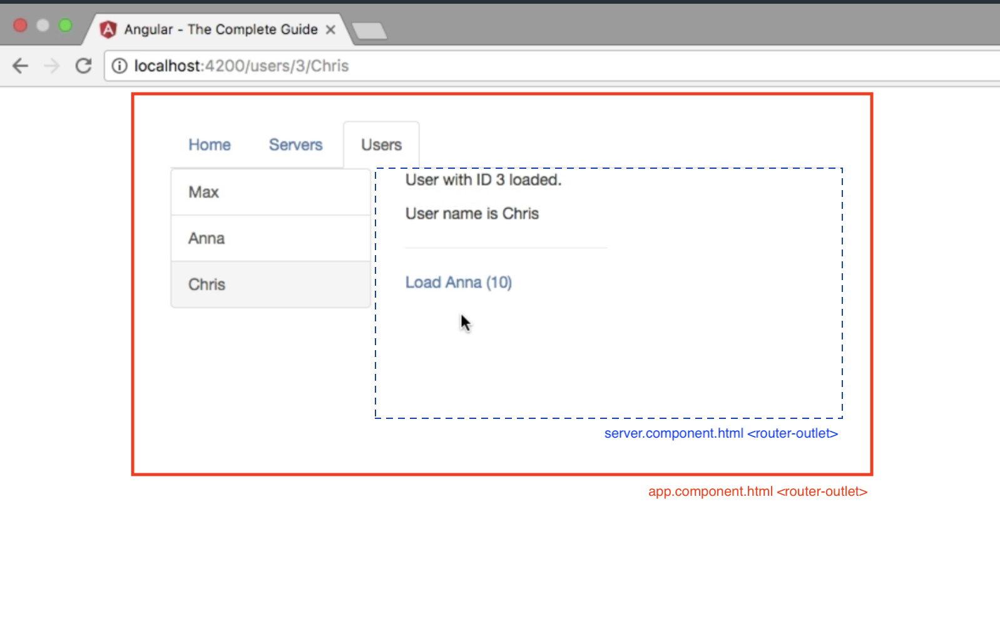

# Routes

## Declaring routes

* Add `RouterModule` in `app.module.ts`, eg.
  
  ```
  const applicationRoutes: Routes[ 
      { path: "",        component: HomeComponent },
      { path: "users",   component: UsersComponent },
      { path: "servers", component: ServersComponent },
  ];
  
  @NgModule({
      imports: [
          RouterModule.forRoot(applicationRoutes)
      ]
  });
  ```

* Add `router-outlet` to `app.component.html`, eg.
  
  ```
  <div class="row">
      <div class="col-xs-12">
          <router-outlet></router-outlet>
      </div>
  </div>
  ```

* Declare links using `routerLink`, eg.
  
  ```
  <a [routerLink]="/users">Users</a>
  ```

* Programmatic navigation, eg.
  
  ```
  constructor(
      private router: Router,
      private route: ActivatedRoute) {
  }

  onShowServersPage() {
      this.router.navigate(['users'], {relativeTo: this.route});
  }
  ```

 *NB.* Use `relativeTo` to ensure navigation from the current position

## External routing modules

When the number of routes is too large for embedding.

* Create routing module, eg. `app-routing.module.ts`
  
  ```
  const appRoutes: Routes = [ ... ];
  
  @NgModule({
      imports: [
          RouterModule.forRoot(appRoutes)
      ],
      exports: [
          RouterModule
      ]
  })
  export class AppRoutingModule {
  }
  ```

* Import module in `app.modules.ts`, eg.
  
  ```
  @NgModule({
      imports: [
          AppRoutingModule
      ]
  })
  ```

## Route parameters

* Declare parameters in route
  
  Use ':' to declare dynamic parameters, eg.
  
  ```
  const applicationRoutes: Routes[ 
      { path: "users/:id/:name",    component: UserComponent },
      { path: "servers/:id",        component: ServerComponent }
      { path: "servers/:id/edit",   component: EditServerComponent }
  ];
  ```

* Loading initial route parameters
  
  ```
  user: {id: number, name: string};
  
  constructor(private route: ActivatedRoute) {
  }
  
  ngOnInit() {
      this.user = {
          id: +this.route.snapshot.params['id'],
          name: this.route.snapshot.params['name']
      };
  }
  ```

  *NB.* Parameters are always strings ; Convert to numeric value using `+`

* Updating route parameters
  
  Imagine a page that has links to itself, eg. view related user
  
  Use [observables](https://angular.io/guide/observables) to update state when the same component is activated with new routes whilst being displaying.
  
  ```
  paramsSubscription: Subscription;
  
  ngOnInit() {
      this.route.params.subscribe( (params: Params) => {
          this.user.id = +params['id'];
          this.user.name = params['name'];
      });
  }
  ```
  
  *NB.* Angular automatically stops subscriptions for observables it provides (eg. `route.params`). 

## Query parameters & Fragments

* Add query parameters to `routerLink`, eg.
  
  ```
  <a
    [routerLink]="['/servers', server.id, 'edit']"
    [queryParams]="{allowEdit: 'true'}"
    fragement="'loading'"
    >Server {{ server.id }}</a>
  ```

* Programmatic routing, eg.
  
  ```
  onEditServer(id: number) {
      this.router.navigate(['/servers', id, 'edit'], {
          queryParams {
              allowEdit: 'true'
          },
          fragment: 'loading'
      });
  }
  ```

* Loading query parameters
  
  ```
  ngOnInit() {
      this.allowEdit = +this.route.snapshot.queryParams['allowEdit'];
      this.gotoLink = this.route.snapshot.fragment;
  }
  ```
  
  *NB.* Both `queryParams` and `fragment` are observables

## Child (Nested) Routes

Allow display of child components inside parent ones, eg.



*NB.* Child routes will typically re-use existing component instances, requiring use of observables to dynamically update route & query parameters

* Declare child routes
  
  ```
  const applicationRoutes: Routes[ 
      { path: "servers", component: ServersComponent, children: [
          { path: ":id",       component: ServerComponent }
          { path: ":id/edit",  component: EditServerComponent }
      ]}
  ];
  ```

* Add `router-outlet` in component HTML

## Preserving query parameters

```
constructor(private route: ActivatedRoute) {
}

onEditServer() {
  this.router.navigate(['edit'], {
    relativeTo: this.route,
    queryParamsHandling: 'preserve'
  });
}
```

Use `queryParamsHandling: merge` when extending parameters.

## Styling route links

For example, apply stated [navbar](https://getbootstrap.com/docs/4.0/components/navbar/) class when route is active.

```
<ul class="nav nav-tabs">
  <li
    routerLinkActive="active"
    [routerLinkActiveOptions]="{exact: true}"><a routerLink="/">Home</a></li>
```

Use `routerLinkActiveOptions` to configure how `routerLinkActive` matches routes.

Use `exact` to stop the '/' route always being active.

NB. All routes start with '/', eg. `/users`

## Redirection & wildcards

Add `not found` page and redirect-all illegal routes to it, eg.

```
const applicationRoutes: Routes[ 
    { path: "not-found", Component: PageNotFoundComponent }
    { path: "**",        redirectTo: "/not-found" }
];
```

`**` wildcard for matching everything.

Always place `**` last.

## canActivate Guard

See [mozilla](https://developer.mozilla.org/en-US/docs/Web/JavaScript/Reference/Global_Objects/Promise) for information about `Promise`

eg. Only allow authenticated users to edit server details

* Declare required services, eg.
  
  ```
  export class AuthService {
      loggedIn = false;
      
      isAuthenticated() {
          const promise = new Promise( (resolve, reject) => {
              setTimeout( () => {
                  resolve(this.loggedIn);
              }, 1000);
          });
      }
      
      login() {
          this.loggedIn = true;
      }
      
      logout() {
          this.loggedIn = false;
      }
  }
  ```

* Declare guard, eg.
  
  ```
  @Injectable()
  export class AuthGuard implements CanActivate, CanActivateChild {
      constructor(private authService: AuthService, private router: Router) {
      }
      
      canActivate(route: ActivatedRouteSnapshot, state: RouterStateSnapshot) : Observable<boolean> | Promise<boolean> | boolean {
          return this.authService.isAuthenticated().then( (authenticated: boolean) => {
              if (authenticated) {
                  return true;
              }
              
              this.router.navigate(['/']);
          });
      }
      
      canActivateChild(route: ActivatedRouteSnapshot, state: RouterStateSnapshot) : Observable<boolean> | Promise<boolean> | boolean {
          return this.canActivate(route, status);
      }
  }
  ```
  
  `CanActivate` can be applied to a single route.
  
  `CanActivateChild` can be applied to a route's children.

* Add guard to route, eg.
  
  ```
  const appRoutes: Routes = [
      {
          path: 'servers',
          component: ServersComponent,
          canActivate: [
              AuthGuard
          ],
          canActivateChild: [
              AuthGuard
          ],
          ...
      },
  ]
  ```
  
  `canActivate` (optional) guards the route
  
  `canActivateChild` (optional) guards all child routes

## canDeactivate Guard

eg. Ask user to confirm when they want to discard changes

* Declare guard, eg.

  ```
  export interface CanComponentDeactivate {
      canDeactivate: () => Observable<boolean> | Promise<boolean> | boolean;
  }
  
  export class CanDeactivateGuard implements CanDeactivate<CanComponentDeactivate> {
      canDeactivate(
          component: CanComponentDeactivate,
          currentRoute: ActivatedRouteSnapshot,
          state: RouterStateSnapshot,
          nextState: RouterStateSnapshot) : Observable<boolean> | Promise<boolean> | boolean {
          
              return component.canDeactivate();
      }
  } 
  ```

* Implement guard in component, eg.
  
  ```
  export class EditServerComponent implements, OnInit, CanComponentDeactivate {
      canDeactivate() : Observable<boolean> | Promise<boolean> | boolean {
          if (!this.changesSaved) {
              // ask user to confirm by displaying confirm dialog
              return confirm('Discard changes?');
          }
          
          return true;
      }
  }
  ```

* Add guard to route, eg.
  
  ```
  const appRoutes: Routes = [
      {
          path: ':id/edit',
          component: EditServerComponent,
          canDeactivate: [
              CanDeactivateGuard
          ],
          ...
      },
  ]
  ```

## resolve Guard

Lookup data as part of routing.

* Declare resolver, eg.

  ```
  interface Server {
      id: number;
      name: string;
      status: string;
  }
  
  @Injectable()
  export class ServerResolver implements Resolve<Server> {
      constructor(private serversService : ServersService) {
      }
      
      resolve(route: ActivatedRouteSnapshot, state: RouterStateSnapshot) : Observable<Server> | Promise<Server> | Server {
          return this.serversService.getServer(+route.params['id']);
      }
  } 
  ```

* Add resolver to route, eg.
  
  ```
  const appRoutes: Routes = [
      {
          path: ':id',
          component: ServerComponent,
          resolve: {
              server: ServerResolver
          },
          ...
      },
  ]
  ```

* Use resolver in component, eg.
  
  ```
  export class ServerComponent implements, OnInit {
      server: {id: number, name: string, status: string};
      
      constructor(private route: ActivatedRoute) {
      }
      
      ngOnInit() {
          // page can be refreshed (with new data) whilst being displayed, so must use observable
          this.route.data.subscribe( (data: Data) => {
              this.server = data['server'];
          });
      }
  }
  ```
  
  NB. `data[]` name must match property name used in `Routes.resolve`
