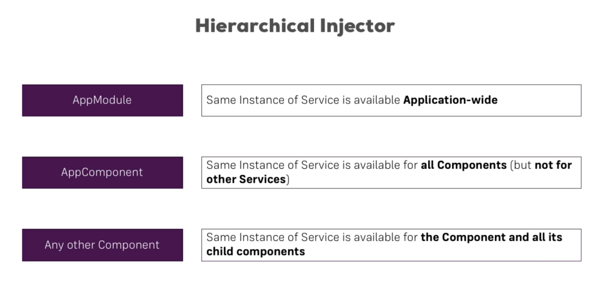

# Services

## Example

```
export class LoggingService {
  logStatusChanged(status: string) {
    console.log('status changed: ' + status);
  }
}

@Injectable
export class AccountsService {
  accounts = [];

  constructor(private logger: LoggingService) {
  }

  addAccount(name: string, status: string) {
    this.accounts.push({name: name, status: status});
    this.logger.logStatusChanged(status);
  }

  updateStatus(id: number, status: string) {
    this.accounts[id].status = status;
    this.logger.logStatusChanged(status);
  }
}
```

Declare in `*.service.ts` files.

Use `@Injectable` when dependency injection required.

Declare service in `providers` when injecting into components or directives, eg.

```
@Component({
  providers: [AccountsService]
})
```

## Cross-Component Communication

Use [subjects](observables.md)

## Dependency injection

Declare global services in `app.module.ts`, eg.

```
@NgModule({
  providers: [AccountsService]
})
```

Declare service in `*.comoponent.ts` for local to component (and its children), eg.

```
@Component({
  providers: [AccountsService]
})
```

Local declarations override global ones, ie.


